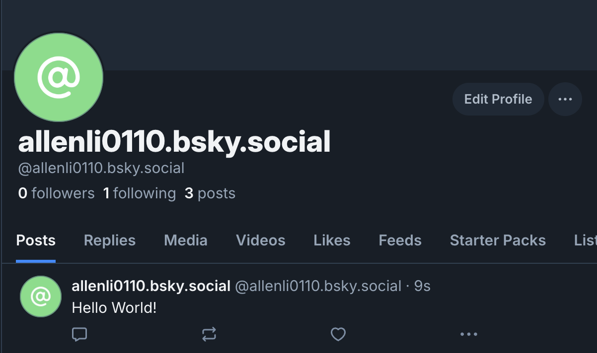

# typescript-nodejs-atprotocol-api

This is a sample API built with TypeScript and Node.js

## Installation and Running

1. Install dependencies:

```
$ npm install
```

2. Compile TypeScript:

```
$ npx tsc
```

3. Run the application:

```
$ node dist/app.js
```

## Testing the APIs

### Login

Authenticate using a username (email) and password to get an access token.

Request:

```
curl -X POST http://localhost:3000/auth/login \
  -H "Content-Type: application/json" \
  -d '{
    "identifier": "account",
    "password": "password"
  }'
```

Response:

```
{
  "message": "Login successful",
  "accessJwt": "YOUR_ACCESS_JWT"
  "refreshJwt": "YOUR_REFRESH_JWT",
  "did": "YOUR_DID",
  "handle": "YOUR_HANDLE"
}
```

### Create a Post

Create a post on the platform. You must pass the access token in the authorization header, along with other required information such as refreshJwt, did, and handle.

Request:

```
curl -X POST http://localhost:3000/posts/create \
  -H "Authorization: Bearer YOUR_ACCESS_TOKEN" \
  -H "Content-Type: application/json" \
  -d '{
    "text": "Hello World!",
    "accessJwt": "YOUR_ACCESS_JWT"
    "refreshJwt": "YOUR_REFRESH_JWT",
    "did": "YOUR_DID",
    "handle": "YOUR_HANDLE"
  }'
```

Response:

```
{
  "message": "Post successful",
  "uri": "at://did:plc:7zbjnmjpeq3k2xtrc2f4pibo/app.bsky.feed.post/3lki7fy2ait24",
  "cid": "bafyreigexvn7k3xs4pq3nsq2xgncptpzroeameqhd7qxmw3l5alft3bhbq"
}
```



### Get Timeline

Request:

```
curl -X GET http://localhost:3000/posts/timeline \
  -H "Authorization: Bearer YOUR_ACCESS_TOKEN" \
  -H "Content-Type: application/json" \
  -d '{
    "refreshJwt": "YOUR_REFRESH_JWT",
    "did": "YOUR_DID",
    "handle": "YOUR_HANDLE"
  }'
```

Response:

```
{
  "timeline": {
    "feed": [
      {
        "post": {
          "uri": "at://did:plc:YOUR_DID/app.bsky.feed.post/YOUR_POST_ID",
          "cid": "YOUR_CID",
          "author": {
            "did": "did:plc:YOUR_DID",
            "handle": "YOUR_HANDLE",
            "displayName": "",
            "avatar": "https://cdn.bsky.app/img/avatar/plain/did:plc:YOUR_DID/YOUR_AVATAR.jpg",
            "createdAt": "2025-03-08T07:09:11.040Z"
          },
          "record": {
            "$type": "app.bsky.feed.post",
            "createdAt": "2025-03-16T08:20:22.993Z",
            "text": "Hello World!"
          },
          "replyCount": 0,
          "repostCount": 0,
          "likeCount": 0,
          "quoteCount": 0
        }
      }
    ]
  }
}
```
